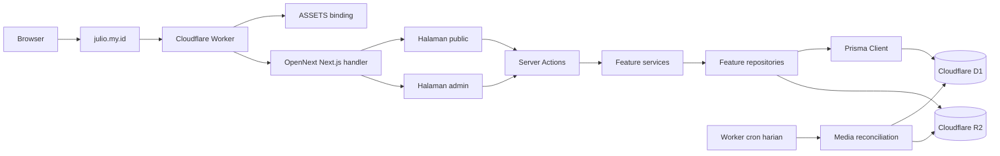
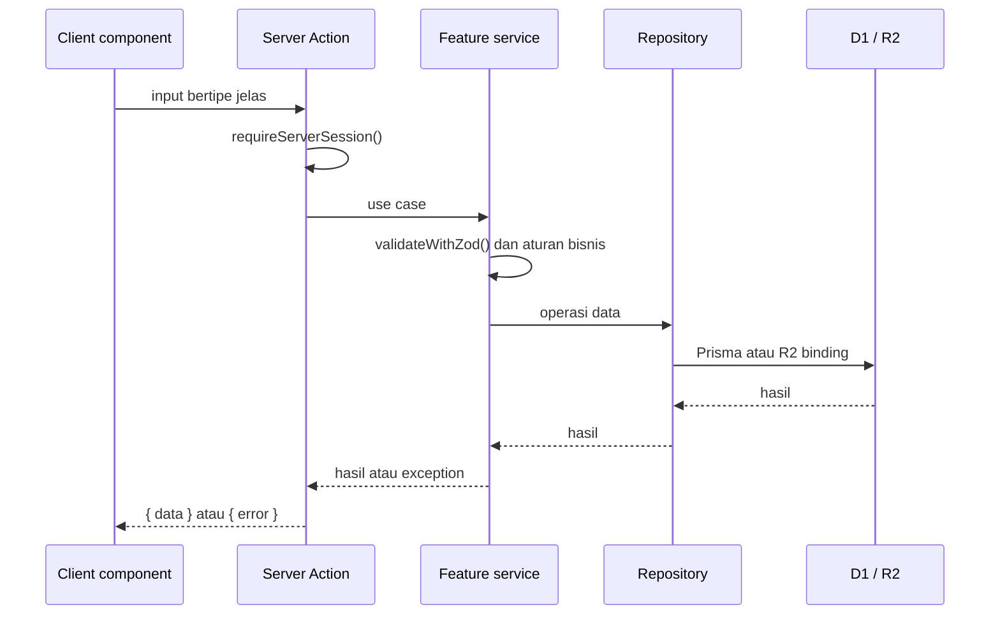
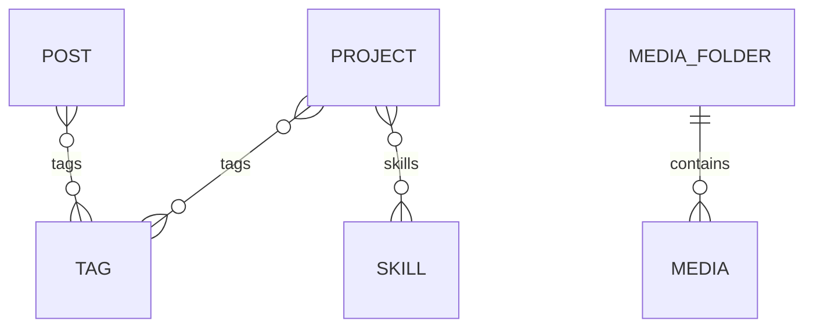
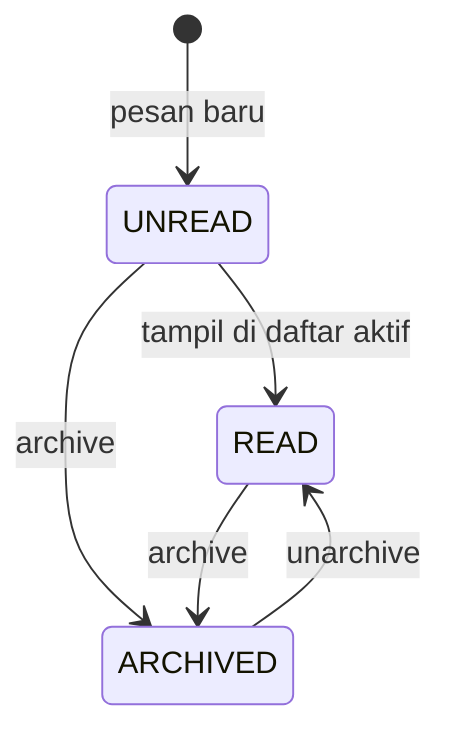

# Architecture Design — Portfolio

> Status: implementasi aktual. Terakhir diverifikasi pada 5 Agustus 2026 terhadap source, konfigurasi, dan schema di repository ini.

Dokumen ini menjelaskan sistem yang benar-benar berjalan, bukan target arsitektur masa depan. Jika terjadi perbedaan, gunakan urutan sumber kebenaran berikut:

1. Source code, `package.json`, `prisma/schema.prisma`, dan konfigurasi runtime.
2. Dokumen ini.
3. `README.md` dan dokumen lama di `docs/`.

`README.md` dan sebagian dokumen lama masih menyebut Neon/PostgreSQL, `shared/`, Docker, GitHub Actions, serta script database yang sudah tidak tersedia. Informasi tersebut tidak menggambarkan runtime saat ini.

## Tujuan

Portfolio adalah CMS ringan untuk mengelola project, tulisan, keahlian, tag, media, informasi kontak, dan pesan masuk. Pengunjung dapat melihat halaman public; admin mengelola konten melalui area `/admin`.

Prioritas implementasi adalah keterbacaan, kesederhanaan, dan kemudahan perawatan untuk developer junior.

### Sasaran arsitektur

- Route tetap tipis dan mudah dilacak dari URL ke komponen.
- Business logic terpisah dari UI dan query database.
- Input divalidasi sebelum business logic dijalankan.
- Operasi admin selalu diperiksa ulang di batas Server Action.
- Infrastruktur Cloudflare digunakan secara native tanpa AWS SDK.
- Abstraksi hanya dibuat jika sudah ada kebutuhan lintas fitur yang nyata.

### Di luar cakupan saat ini

- REST API publik, Route Handler, GraphQL, atau HTTP controller khusus.
- Multi-user, role, permission, registrasi akun, dan pemulihan kata sandi.
- Repository interface generik, dependency injection container, atau event bus.
- Transaksi terdistribusi antara D1 dan R2.
- CI/CD GitHub Actions; verifikasi dan deployment masih dijalankan melalui command lokal.

## Stack

| Kategori | Teknologi | Versi utama |
| --- | --- | --- |
| Framework | Next.js App Router | 15 |
| UI | React | 19 |
| Bahasa | TypeScript strict | 5 |
| Styling | Tailwind CSS | 4 |
| Icon | react-icons | 5 |
| Form | Native `FormData` + React local state | — |
| Server interface | Next.js Server Actions | Bawaan Next.js |
| Database | Cloudflare D1 (SQLite) | — |
| ORM | Prisma + `@prisma/adapter-d1` | 7 |
| Penyimpanan berkas | Cloudflare R2 | — |
| Adapter deployment | OpenNext Cloudflare | 1 |
| Runtime/deployment | Cloudflare Workers + Wrangler | 4 |
| Autentikasi | jsonwebtoken, HS256 access/refresh token | 9 |
| Hash kata sandi | bcryptjs | 3 |
| Validasi | Zod | 4 |
| Rich text | Tiptap, disimpan sebagai JSON | 3 |
| Sanitasi HTML | sanitize-html | 2 |
| Notifikasi | react-toastify | 11 |
| Unit/component test | Vitest + Testing Library | 4 |
| E2E test | Playwright | 1 |
| Linter/formatter | Biome | 2 |

`—` berarti layanan cloud atau standar yang tidak memakai versi package aplikasi.

`react-hook-form` masih tercantum sebagai dependency, tetapi form aplikasi saat ini memakai `FormData` dan local state. Karena belum dipakai source, package tersebut bukan bagian dari keputusan arsitektur aktif.

## Gambaran Sistem



Tidak ada REST API atau Route Handler khusus saat ini. Operasi baca dan mutasi aplikasi dilakukan melalui Next.js Server Actions.

### Runtime request

1. Cloudflare menerima request untuk custom domain.
2. `worker.ts` mengalihkan hostname `www` ke apex domain dengan status 308 dan mempertahankan path/query.
3. Request lain diteruskan ke handler hasil build `.open-next/worker.js`.
4. Asset statis dilayani melalui binding `ASSETS` dari `.open-next/assets`.
5. Server Components dan Server Actions mengakses D1/R2 melalui Cloudflare context.

### Runtime Prisma

`src/lib/database/prisma.ts` tidak membuka file SQLite. Runtime membuat `PrismaClient` dengan `PrismaD1` dari binding `portfolio_db`. Client di-resolve secara lazy melalui `Proxy` dan disimpan di `globalThis` agar tidak dibuat ulang pada setiap import.

Cron membuat Prisma Client sendiri, menjalankan reconciliation, lalu selalu memanggil `$disconnect()`. Saat development, `initOpenNextCloudflareForDev()` dan `instrumentation.ts` menyediakan Cloudflare context untuk runtime Next.js lokal.

## Struktur Folder

```text
src/
├── app/                         # Route App Router; page, layout, sitemap, 404
│   ├── (public)/                # Halaman untuk pengunjung
│   ├── admin/                   # Halaman CMS yang membutuhkan sesi admin
│   └── login/                   # Halaman login admin
├── components/
│   ├── admin/                   # UI khusus CMS
│   ├── public/                  # UI khusus halaman pengunjung
│   ├── editor/                  # Rich text editor Tiptap
│   ├── layout/                  # Navbar, footer, section, dan navigasi admin
│   ├── login/                   # UI login admin
│   ├── media/                   # Pemilih gambar dari galeri
│   ├── providers/               # Theme dan toast provider
│   └── ui/                      # Komponen UI kecil yang dipakai lintas area
├── features/                    # Business logic per domain
│   ├── auth/
│   ├── contact/
│   ├── dashboard/
│   ├── media/
│   ├── messages/
│   ├── posts/
│   ├── projects/
│   ├── skills/
│   └── tags/
├── generated/prisma/            # Prisma Client hasil generate; jangan diedit manual
└── lib/                         # Utilitas dan infrastruktur lintas fitur
    ├── auth/
    ├── database/
    ├── server-action-exception/
    ├── tiptap/
    ├── validation/
    ├── env.ts
    ├── slug.ts
    ├── publish-status.ts
    ├── message-status.ts
    └── rich-text.ts

prisma/
├── schema.prisma                # Skema Prisma untuk SQLite/D1
├── migrations/                  # Migration SQL
├── seed.mts                     # Entry seed akun admin
└── seed-logic.mts               # Hash dan bentuk data seed yang dapat diuji

test/                            # Unit dan component test, mengikuti area source
e2e/                             # End-to-end test Playwright
public/                          # Asset publik Next.js
docs/                            # Issue, referensi layout, dan dokumen lama
instrumentation.ts              # Inisialisasi Cloudflare context pada Node runtime
next.config.ts                  # Next config, body limit, dan Prisma WASM workaround
open-next.config.ts             # Konfigurasi adapter OpenNext
worker.ts                        # Entry Cloudflare Worker dan cron reconciliation
wrangler.jsonc                   # Binding D1/R2, domain, serta jadwal cron
```

### Aturan folder

1. `app/` hanya menangani routing, pengambilan data untuk halaman, dan penyusunan komponen.
2. `components/public/` dan `components/admin/` dipisahkan berdasarkan area pengguna, bukan berdasarkan jenis elemen UI.
3. `components/ui/` hanya untuk UI kecil yang dipakai lintas area, misalnya `Button`, `FormField`, dan `StatusMessage`.
4. `lib/` hanya berisi utilitas atau infrastruktur lintas fitur; ia bukan tempat business logic milik satu fitur.
5. `generated/prisma/` adalah hasil Prisma dan tidak boleh diedit manual.
6. File feature memakai nama yang eksplisit: `<feature>.action.ts`, `.services.ts`, `.repository.ts`, `.schema.ts`, dan `.type.ts`.
7. Komponen React memakai PascalCase; function/variable memakai camelCase; constant global memakai UPPER_SNAKE_CASE.

## Route dan Access Matrix

### Route public

| Route | Data/fitur | Perilaku penting |
| --- | --- | --- |
| `/` | 3 project, 3 post, semua skill, contact info | Kegagalan data ditampilkan sebagai bagian kosong |
| `/about` | Konten statis | Tetap dynamic karena mewarisi public layout |
| `/portfolio` | Semua project `PUBLISHED` | Pagination UI 6 item setelah semua record diambil |
| `/portfolio/[slug]` | Detail project `PUBLISHED` | Data tidak tersedia atau action gagal menghasilkan 404 |
| `/blog` | Semua post `PUBLISHED` | Belum memiliki pagination |
| `/blog/[slug]` | Detail post + previous/next | Data tidak tersedia atau action gagal menghasilkan 404 |
| `/contact` | Contact info + form pesan | `sendMessage()` dapat dipanggil tanpa sesi |
| `/login` | Form autentikasi | Sesi valid langsung redirect ke `/admin` |
| `/sitemap.xml` | Route public statis | Slug project/post belum ikut sitemap |
| not-found | Halaman 404 | Memakai navbar/footer statis |

### Route admin

Semua route berikut dilindungi oleh `src/app/admin/layout.tsx`. Layout membaca sesi dan redirect ke `/login` jika tidak valid. Setiap Server Action admin tetap memanggil `requireServerSession()` sebagai pemeriksaan kedua.

| Route | Tanggung jawab | Pagination |
| --- | --- | --- |
| `/admin` | Ringkasan total, published, dan 5 item terbaru | — |
| `/admin/projects` | Daftar dan hapus project | 10 per halaman |
| `/admin/projects/new` | Membuat project, memilih tag/skill/media | — |
| `/admin/projects/[id]` | Mengubah project | — |
| `/admin/posts` | Daftar dan hapus tulisan | 10 per halaman |
| `/admin/posts/new` | Membuat tulisan, memilih tag/media | — |
| `/admin/posts/[id]` | Mengubah tulisan | — |
| `/admin/skills` | CRUD skill dan memilih icon dari media | Semua data |
| `/admin/tags` | CRUD tag | Semua data |
| `/admin/media` | Folder, upload, gallery, dan delete media | 24 per halaman |
| `/admin/messages` | Pesan aktif/arsip | 10 per halaman |
| `/admin/contact` | CRUD contact info dan memilih icon | Semua data |
| `/admin/contact-info` | Implementasi yang sama dengan `/admin/contact` | Alias lama, tidak ada di navigasi |
| `/admin/password` | Mengubah kata sandi admin aktif | — |

Tidak ada `middleware.ts`. Perlindungan route dilakukan oleh admin layout, sedangkan perlindungan operasi data dilakukan kembali di Server Action.

## Rendering dan Batas Komponen

- Semua `page.tsx` dan `layout.tsx` adalah Server Components secara default.
- Client Components hanya dipakai ketika membutuhkan state, event browser, modal, form interaktif, theme, atau toast.
- Page mengambil data melalui feature action, lalu meneruskan hasil yang sudah siap tampil ke komponen.
- Client Component dapat memanggil Server Action, tetapi tidak boleh memanggil service/repository langsung.
- Validasi client hanya untuk feedback cepat; validasi authoritative tetap dijalankan service.

Client Components utama adalah form/manager admin, login/contact form, `RichTextEditor`, media picker, navbar/admin navigation, theme/toast provider, confirm dialog, dan share links. Card public, footer, section, dashboard overview, dan mayoritas display component tetap Server Components.

`src/app/(public)/layout.tsx` menetapkan `dynamic = "force-dynamic"` karena contact info footer dibaca dari D1. Akibatnya seluruh route di group `(public)`, termasuk `/about`, dirender dinamis dan dapat melakukan request D1 pada setiap page request.

### Design system dan provider

- `globals.css` mendefinisikan semantic tokens `canvas`, `surface`, `text`, `text-mute`, `border`, `accent`, `primary`, dan `danger`.
- Tailwind menggunakan token tersebut melalui `@theme inline`; komponen tidak perlu mengulang warna hardcoded untuk theme dasar.
- `ThemeProvider` menyimpan pilihan light/dark pada `localStorage` dan memasang `data-theme` di root document.
- `ToastProvider` dipasang sekali di root layout; toast tampil di top-center dan auto-close setelah 5 detik.
- `components/ui` adalah design-system primitives; `components/layout` adalah struktur halaman lintas area.

## Feature-Based Layered Architecture

Setiap domain utama berada di `src/features/<feature>/`. Tidak semua fitur memiliki setiap file, tetapi perannya konsisten.

| Feature | Operasi public | Operasi admin / internal |
| --- | --- | --- |
| `auth` | Login | Logout, ubah password, session user |
| `contact` | Membaca contact info | List dan CRUD contact info |
| `dashboard` | — | Count project/post/skill/tag dan item terbaru |
| `media` | — | Gallery, folder, upload/delete, reconciliation |
| `messages` | Mengirim pesan | List, pagination, mark read, archive/unarchive |
| `posts` | List published, detail slug, previous/next | List, pagination, detail ID, CRUD, reading time |
| `projects` | List published dan detail slug | List, pagination, detail ID, CRUD |
| `skills` | List skill | List dan CRUD skill |
| `tags` | Disertakan melalui post/project | List dan CRUD tag |

Pengecualian yang disengaja:

- `dashboard` tidak memiliki schema karena tidak menerima input.
- `media` memiliki `media.reconcile.ts` untuk job terjadwal.
- Page menyusun beberapa feature sekaligus, misalnya Home dan form Post/Project; feature tidak mengambil data internal feature lain secara langsung.

```text
src/features/projects/
├── projects.action.ts       # Server Action: auth, try/catch, bentuk respons
├── projects.services.ts     # Validasi dan aturan bisnis
├── projects.repository.ts   # Query Prisma atau akses R2
├── projects.schema.ts       # Schema Zod
└── projects.type.ts         # Type feature
```

| Layer | Tanggung jawab | Boleh bergantung pada |
| --- | --- | --- |
| `*.action.ts` | Pintu masuk Server Action, cek sesi admin, tangkap exception, bentuk respons `{ data }` atau `{ error }` | service, auth, exception mapper, type |
| `*.services.ts` | Validasi Zod, aturan bisnis, transformasi data, exception bisnis | repository, schema, type, `lib/` |
| `*.repository.ts` | Query Prisma dan operasi object storage yang dekat dengan data | Prisma, Cloudflare binding |
| `*.schema.ts` | Kontrak validasi input dengan Zod | Zod |
| `*.type.ts` | Type input, output, dan model view feature | Prisma type bila diperlukan |

Repository memakai `select` Prisma yang eksplisit agar hanya field yang dibutuhkan yang keluar dari data layer. Date yang melewati batas Server Action diubah menjadi string ISO oleh service bila diperlukan.

Alur mutasi admin:



### Aturan dependensi

1. Komponen tidak memanggil repository secara langsung.
2. Action tidak berisi query Prisma atau aturan bisnis.
3. Service tidak membentuk respons UI; service mengembalikan data atau melempar exception yang bermakna.
4. Repository tidak melakukan validasi form atau membuat slug.
5. Fitur tidak mengimpor internal fitur lain. Kebutuhan lintas fitur ditempatkan di `lib/` atau disusun di route/page.

## Input, Validasi, dan Error

`validateWithZod()` di `src/lib/validation/zod.ts` menyamakan hasil validasi Zod:

```ts
type ZodValidationResult<TData> =
  | { success: true; data: TData }
  | { success: false; fields: Record<string, string> };
```

Service mengubah kegagalan validasi atau aturan bisnis menjadi exception sederhana:

- `ValidationException`
- `UnauthorizedException`
- `NotFoundException`
- `ConflictException`
- `InternalServerErrorException`

Action menangkap exception tersebut melalui `toServerActionFailure()`. Kontrak error Server Action untuk developer/UI saat ini adalah:

```ts
type ServerActionFailure = {
  error: {
    code: "VALIDATION_ERROR" | "UNAUTHORIZED" | "NOT_FOUND" | "CONFLICT" | "INTERNAL_SERVER_ERROR";
    message: string;
    fields?: Record<string, string>;
  };
};
```

Kontrak sukses selalu memakai bentuk `{ data: T }`. Action tidak meneruskan expected exception ke komponen; action mengubahnya menjadi `ServerActionFailure`. Error yang tidak dikenal dicatat ke console dan diubah menjadi `INTERNAL_SERVER_ERROR`.

Beberapa komponen saat ini masih menampilkan `error.message` secara langsung, sedangkan komponen lain memetakannya ke kalimat UI. Pemisahan pesan developer dan pesan pengguna belum konsisten dan dicatat sebagai pekerjaan lanjutan. Kontrak ini bukan HTTP response dan tidak membawa status code.

### Sumber kontrak

| Kontrak | Sumber utama |
| --- | --- |
| Bentuk database dan relasi | `prisma/schema.prisma` |
| Input business use case | `*.schema.ts` (Zod) |
| Input/output TypeScript | `*.type.ts` |
| Success/failure Server Action | Return type action + `ServerActionFailure` |
| Status aplikasi | `lib/publish-status.ts` dan `lib/message-status.ts` |
| Rich-text document | Tiptap JSON + `lib/tiptap/json.ts` |

Gunakan Mermaid untuk diagram arsitektur/state/ERD dan TypeScript object shape untuk kontrak action. Jangan menambahkan status HTTP pada Server Action hanya untuk meniru REST API.

## Autentikasi Admin

1. Akun admin dibuat dengan seed/upsert ke tabel `User`; tidak ada registrasi.
2. Login mencari user berdasarkan username dan membandingkan `passwordHash` dengan bcryptjs (salt rounds 10).
3. Login berhasil membuat access token dan refresh token menggunakan algoritma HS256.
4. Claim berisi `sub` sebagai user ID, `username`, dan `tokenType` agar refresh token tidak diterima sebagai access token.
5. Verifier memeriksa algorithm, JWT type, token type, `iat`, `exp`, subject, dan username.
6. Token disimpan pada cookie dan dibaca hanya di server.
7. Admin layout memblokir navigation tanpa sesi; setiap Server Action admin tetap memvalidasi sesi.
8. Logout mengosongkan kedua cookie.

| Token | Masa berlaku | Cookie |
| --- | ---: | --- |
| Access | 15 menit | `admin_access_token` |
| Refresh | 7 hari | `admin_refresh_token` |

Opsi cookie: `httpOnly`, `sameSite: "lax"`, path `/`, dan `secure` hanya saat production. `maxAge` mengikuti TTL token.

Jika access token invalid tetapi refresh token masih valid, `resolveSessionTokens()` membuat access token baru di memori dan menerima sesi. `getServerSession()` saat ini tidak menulis access token baru itu kembali ke cookie. Sistem juga tidak melakukan refresh-token rotation.

JWT bersifat stateless: session tidak memeriksa ulang keberadaan user di D1 pada setiap request. Menghapus user atau mengganti password tidak otomatis membatalkan token yang sudah terbit sebelum token kedaluwarsa.

## Data dan Storage

### Database

Prisma menggunakan provider SQLite dengan runtime Cloudflare dan `PrismaD1` adapter. Pada deployment, binding `portfolio_db` menunjuk Cloudflare D1.

Entitas utama:

| Entitas | Peran |
| --- | --- |
| `User` | Kredensial admin |
| `Project` | Portfolio project; memiliki tag dan skill |
| `Post` | Tulisan/blog; memiliki tag |
| `Tag` | Label untuk project dan tulisan |
| `Skill` | Keahlian yang dapat dihubungkan ke project |
| `Media` | Metadata object gambar R2 |
| `MediaFolder` | Folder galeri; satu folder memiliki banyak media |
| `Message` | Pesan dari formulir contact |
| `ContactInfo` | Link/icon kontak untuk halaman public dan footer |

### Field dan constraint penting

| Model | Field/constraint utama | Index/relasi |
| --- | --- | --- |
| `User` | `id`, unique `username`, `passwordHash` | Tidak memiliki role/permission |
| `Project` | unique `slug`, title, description, JSON content string, URL, thumbnail, status, timestamps | index `slug`; index `(status, publishedAt)`; M:N Tag dan Skill |
| `Post` | unique `slug`, title, description, JSON content string, `readingTime`, thumbnail, status, timestamps | index `slug`; index `(status, publishedAt)`; M:N Tag |
| `Tag` | unique `name`, unique `slug`, `createdAt` | M:N Project dan Post |
| `Skill` | unique `name`, unique `slug`, nullable icon, `createdAt` | M:N Project |
| `MediaFolder` | unique `name`, `createdAt` | 1:N Media |
| `Media` | unique `objectKey`, file metadata, public URL, nullable `folderId` | index `folderId`; folder delete memakai `SetNull` |
| `Message` | name, email, message, status, timestamps | index `(status, createdAt)` |
| `ContactInfo` | label, URL value, nullable icon | Tidak memiliki ordering column |

Relasi Project–Tag, Project–Skill, dan Post–Tag menggunakan implicit many-to-many Prisma. Status Project/Post/Message disimpan sebagai `String`; validitasnya dijaga oleh application layer, bukan constraint database.

Relasi utama:



Kolom `content` pada `Project` dan `Post` bertipe `String` di database, tetapi nilainya adalah JSON document Tiptap yang diserialisasi oleh `src/lib/tiptap/json.ts`.

### Publish lifecycle

Nilai status Project dan Post:

```text
DRAFT | PUBLISHED | ARCHIVED
```

- Create tanpa status memakai `DRAFT`.
- Hanya record `PUBLISHED` yang dapat dibaca melalui action public.
- Create sebagai `PUBLISHED` mengisi `publishedAt` dengan waktu sekarang.
- Update pertama menuju `PUBLISHED` mengisi `publishedAt`.
- Setelah pernah terbit, `publishedAt` dipertahankan saat status kembali ke `DRAFT` atau `ARCHIVED`.
- Tidak ada transition guard; admin dapat berpindah dari status mana pun ke status lain.
- Post public juga mensyaratkan `publishedAt` tidak null.

Slug dibuat dari title/name menggunakan shared slug generator. Slug dicek unik dan diberi suffix saat collision. Slug Project/Post dibuat ulang hanya ketika title berubah; slug Skill/Tag mengikuti aturan service masing-masing.

### Message lifecycle



Tab `aktif` memuat `UNREAD` dan `READ`; tab `arsip` hanya memuat `ARCHIVED`. Pesan unread yang tampil pada halaman aktif ditandai read sebelum halaman selesai dirender.

### Pagination dan ordering

| Area | Ukuran halaman | Query/order |
| --- | ---: | --- |
| Home project/post | 3 | `publishedAt desc` |
| Public portfolio | 6 di UI | Backend mengambil semua published, lalu page melakukan `slice()` |
| Public blog | Tidak ada pagination | Semua published, `publishedAt desc` |
| Admin project | 10 | `createdAt desc`, database `skip/take` |
| Admin post | 10 | `createdAt desc`, database `skip/take` |
| Admin message | 10 | Filter status, database `skip/take` |
| Media gallery dan picker | 24 | `fileName asc`, kemudian `createdAt desc` |
| Media folder | Semua | `name asc` |
| Skill dan tag | Semua | Diurutkan alfabetis untuk UI |

Page admin yang melebihi total halaman di-clamp ke halaman terakhir. Total page minimum selalu 1. Public Portfolio belum melakukan database pagination, sehingga biaya query bertambah seiring jumlah project.

## Rich Text

Project dan Post memakai pipeline yang sama:

```text
Tiptap editor JSON
  -> hidden form field berupa JSON string
  -> Zod memeriksa document valid dan tidak kosong
  -> service serialize ke String
  -> D1 Project.content / Post.content
  -> service parse menjadi RichTextDocument
  -> Tiptap static renderer menghasilkan HTML
  -> sanitize-html
  -> public detail merender HTML
```

Sanitizer hanya mengizinkan tag/attribute/style yang terdaftar. Link dibatasi ke `http`, `https`, dan `mailto`, selalu diberi `target="_blank"` serta `rel="noopener noreferrer"`. Image hanya diterima dari URL `http/https`. Warna dan text alignment dibatasi oleh pola yang eksplisit.

Reading time Post dihitung dari plain text Tiptap dengan 200 kata per menit dan minimum 1 menit.

## Media R2 dan D1

Object gambar disimpan melalui native R2 binding `PORTFOLIO_MEDIA`; project tidak memakai AWS SDK atau presigned URL. Tabel `Media` di D1 menyimpan metadata dan menjadi index galeri aplikasi.

Batas upload:

- format JPEG, PNG, atau WebP;
- ukuran file maksimum 2 MB;
- Server Action body maksimum 3 MB;
- object key: `media/<folder-id|root>/<uuid>.<extension>`;
- public URL: `R2_PUBLIC_URL` + object key.

Folder hanya dapat dihapus melalui service jika tidak memiliki media. Schema memakai `onDelete: SetNull` sebagai pertahanan database, tetapi UI/business rule tetap mewajibkan folder kosong.

### Consistency model

R2 dan D1 tidak memiliki transaksi bersama. Urutan operasi saat ini:

```text
Upload: file -> R2 put -> D1 Media create
Delete: R2 delete -> D1 Media delete
```

Jika langkah kedua gagal, data dapat tidak sinkron. Sistem menerima eventual consistency dan memakai cron sebagai compensating process:

- R2 upload berhasil tetapi insert D1 gagal: object orphan dihapus cron.
- R2 delete berhasil tetapi delete D1 gagal: record orphan dihapus cron.

D1 juga tidak memberi jaminan transaksi yang sama seperti PostgreSQL untuk rangkaian query Prisma. Jangan merancang business flow yang mengandalkan rollback multi-query tanpa memeriksa dukungan D1.

### Reconciliation harian

Worker menjalankan reconciliation setiap hari pukul 02:00 UTC melalui `ctx.waitUntil()`:

1. List seluruh object bucket dengan page size 1.000.
2. Ambil seluruh pasangan ID/object key dari tabel `Media`.
3. Hapus object R2 yang tidak memiliki record D1.
4. Hapus record D1 yang object R2-nya tidak tersedia.

> Invariant keamanan: bucket `portfolio` harus dedicated untuk aplikasi dan database ini. Reconciler tidak membatasi prefix dan memindai seluruh bucket. Upload manual atau object milik aplikasi/database lain akan dianggap orphan lalu dihapus oleh cron.

## Environment dan Cloudflare Binding

### Environment variables

| Nama | Wajib | Secret | Fungsi |
| --- | --- | --- | --- |
| `ADMIN_USERNAME` | Ya pada env schema/seed | Tidak | Username akun admin awal |
| `ADMIN_PASSWORD` | Ya pada env schema/seed | Ya | Password seed, minimum 8 karakter |
| `JWT_ACCESS_SECRET` | Ya | Ya | Signing access token, minimum 32 karakter |
| `JWT_REFRESH_SECRET` | Ya | Ya | Signing refresh token, minimum 32 karakter |
| `R2_PUBLIC_URL` | Ya | Tidak | Base URL public object media |
| `NEXT_PUBLIC_SITE_URL` | Opsional | Tidak | Base URL sitemap; fallback localhost |
| `NEXT_DIST_DIR` | Opsional | Tidak | Memisahkan output Next build, dipakai E2E |
| `NODE_ENV` | Dikelola runtime | Tidak | Mengaktifkan secure cookie di production |

Login tidak membandingkan input langsung dengan `ADMIN_USERNAME`/`ADMIN_PASSWORD`; login selalu membaca tabel `User`. Kedua variable admin dipakai untuk membentuk akun awal melalui seed. Namun `src/lib/env.ts` saat ini memvalidasi kelima variable wajib sebagai satu object, sehingga semuanya harus tersedia ketika module tersebut dimuat.

`.env*` dan `.dev.vars*` di-ignore Git. Secret production disimpan sebagai Worker variables/secrets di Cloudflare, bukan di source atau test fixture production.

### Bindings

| Binding | Resource | Pemakai |
| --- | --- | --- |
| `portfolio_db` | Cloudflare D1 `portfolio-db` | Prisma runtime dan cron |
| `PORTFOLIO_MEDIA` | R2 bucket `portfolio` | Upload/delete/reconciliation |
| `ASSETS` | `.open-next/assets` | Static asset serving OpenNext |

## Development, Migration, dan Seed

Ada dua konteks database yang harus dibedakan:

| Konteks | Koneksi |
| --- | --- |
| Prisma CLI (`migrate dev`, Studio) | `file:./prisma/dev.db` dari `prisma.config.ts` |
| Runtime Next.js/Worker | D1 binding `portfolio_db` melalui `PrismaD1` |

Alur perubahan schema:

```text
ubah prisma/schema.prisma
  -> npx prisma migrate dev --name <nama-migration>
  -> review prisma/migrations/<timestamp>_<nama>/migration.sql
  -> npx prisma generate
  -> npx wrangler d1 migrations apply portfolio-db --remote
```

Wrangler membaca `migrations_dir` dan `migrations_pattern` dari `wrangler.jsonc`, sehingga migration remote tidak perlu menunjuk file SQL satu per satu. `npx prisma studio` hanya membuka `prisma/dev.db`, bukan D1 remote.

Seed dijalankan melalui:

```text
node --env-file=.env prisma/seed.mts
```

Seed memakai `getPlatformProxy()` dan binding D1 dari Wrangler, lalu melakukan upsert username. Periksa target database pada output Wrangler sebelum menjalankannya. Saat ini tidak ada script `db:migrate`, `db:seed`, atau `d1:migrate:remote` di `package.json`; gunakan command eksplisit di atas sampai script tersebut benar-benar ditambahkan.

## Deployment Cloudflare

`npm run build` hanya menghasilkan build Next.js. Artifact Worker dibuat oleh OpenNext:

```text
npm run build:worker
npm run deploy:worker:dry-run
npm run deploy:worker
```

`deploy:worker` menjalankan build OpenNext lalu Wrangler deploy. `worker.ts` membungkus generated `.open-next/worker.js` untuk redirect domain dan scheduled handler.

Keputusan build penting:

- Prisma Client menggunakan `runtime = "cloudflare"`.
- `compilerBuild = "small"` dipilih untuk menekan ukuran Worker.
- `next.config.ts` mengarahkan `query_compiler_small_bg.wasm?module` ke generated WASM agar bundle dapat menemukan compiler.
- Server Action body limit dinaikkan menjadi 3 MB.
- `open-next.config.ts` memakai konfigurasi default tanpa custom incremental/tag cache provider.
- `nodejs_compat` aktif dengan compatibility date `2026-07-25`.

`wrangler.jsonc` mendefinisikan:

- custom domain `julio.my.id`;
- redirect `www.julio.my.id` ke root domain melalui `worker.ts`;
- binding D1 `portfolio_db`;
- binding R2 `PORTFOLIO_MEDIA`;
- binding static asset `ASSETS`;
- cron `0 2 * * *` untuk sinkronisasi media.

`workers_dev` dan preview URL dinonaktifkan. Deployment production diakses melalui custom domain, bukan subdomain `workers.dev`.

## Pengujian dan Pemeriksaan

| Perintah | Tujuan |
| --- | --- |
| `npm run lint` | Lint dan pemeriksaan Biome |
| `npm run format` | Format kode dengan Biome |
| `npm run type-check` | Pemeriksaan TypeScript tanpa emit |
| `npm run test` | Unit dan component test Vitest |
| `npm run test:e2e` | Alur pengguna penting dengan Playwright |
| `npm run deploy:worker:dry-run` | Build Worker dan validasi deploy tanpa mengunggah |

Vitest memakai environment jsdom, Testing Library, dan hanya memuat `test/**/*.test.{ts,tsx}`. Test mencakup action, service, repository, auth token, exception mapper, Zod helper, slug, Tiptap, media reconciliation, seed logic, page, dan komponen utama.

Playwright dikonfigurasi untuk Chromium desktop di port 3001 dengan output build `.next-e2e`, satu worker, dan retry dua kali di CI. E2E saat ini mencakup home, about, portfolio, blog, contact, login, serta beberapa skenario 404; belum mencakup login sukses dan CRUD admin.

> Known test issue: `playwright.config.ts` memanggil `npm run build:next`, tetapi script `build:next` tidak tersedia di `package.json`. Karena itu `npm run test:e2e` belum boleh dianggap sehat pada clean environment sampai script/config diperbaiki.

Tidak ada workflow `.github/workflows`. Lint, test, type-check, build, dan deployment dilakukan secara manual melalui command project.

Untuk perubahan feature, minimal jalankan lint, type-check, dan test yang relevan. Jalankan seluruh test sebelum merge ketika perubahan menyentuh UI lintas area, autentikasi, media, database, atau infrastruktur.

## Security Boundaries

Yang sudah diterapkan:

- input authoritative divalidasi Zod di service;
- admin layout dan Server Action sama-sama memeriksa session;
- password di-hash dengan bcryptjs;
- JWT diverifikasi algorithm, type, claim, dan expiry;
- cookie sesi `httpOnly` dan secure di production;
- output rich text disanitasi sebelum dirender;
- URL link/image rich text dibatasi protocol;
- secret dan local database di-ignore Git.

Yang belum diterapkan:

- rate limiting atau lockout untuk login;
- CAPTCHA/Turnstile atau rate limiting untuk form contact;
- token revocation/session table;
- audit log aktivitas admin;
- role dan permission;
- malware scanning atau image re-encoding saat upload.

## Observability

Observability saat ini menggunakan `console.log`/`console.error` dan log Cloudflare Worker. Belum ada structured logging, request correlation ID, alerting, error tracking eksternal, atau metric aplikasi khusus.

Cron mencatat hasil reconciliation (`deletedOrphanObjects` dan `deletedOrphanRecords`) ke log. Error tidak dilempar keluar scheduled handler setelah dicatat agar Worker dapat menyelesaikan lifecycle dengan aman.

## Known Limitations dan Risiko

| Prioritas | Kondisi saat ini | Dampak |
| --- | --- | --- |
| Tinggi | Reconciler memindai seluruh bucket tanpa prefix | Bucket bersama dapat kehilangan object aplikasi lain |
| Tinggi | Login/contact tidak memiliki rate limit atau bot protection | Brute force dan spam belum dibatasi aplikasi |
| Sedang | D1 dan R2 tidak atomik | Orphan sementara sampai cron berikutnya |
| Sedang | Playwright memanggil script `build:next` yang tidak ada | E2E clean run dapat gagal sebelum test |
| Sedang | Public layout selalu dynamic | Bahkan halaman statis memicu runtime request/contact query |
| Sedang | Public Portfolio mengambil semua data; Blog tanpa pagination | Query/payload tumbuh mengikuti jumlah konten |
| Sedang | Refresh-generated access token tidak ditulis kembali | Request berikutnya terus bergantung pada refresh token |
| Rendah | `/admin/contact-info` menduplikasi `/admin/contact` | Dua URL untuk UI yang sama |
| Rendah | Beberapa page mengubah action error menjadi empty state/404 | Internal failure dapat terlihat seperti data kosong/not found |
| Rendah | Sitemap tidak memuat slug dinamis | Detail project/post tidak tercantum di sitemap |
| Rendah | README dan sebagian docs belum mengikuti D1/lib architecture | Setup baru mudah mengikuti instruksi lama yang salah |

## Batas Arsitektur Saat Ini

- Tidak ada HTTP controller atau status code response khusus karena aplikasi memakai Server Actions, bukan REST API.
- Tidak ada interface repository generik. Repository tetap function eksplisit agar mudah dibaca.
- Exception di `lib/server-action-exception/` adalah kontrak internal action/service; dedicated UI error mapping belum konsisten.
- `unknown` hanya wajar di trust boundary seperti caught error dan hasil parse JSON; input feature memakai type yang eksplisit.
- Perubahan struktur baru dibuat jika menyelesaikan kebutuhan nyata, bukan untuk mengejar abstraksi teoritis.

## Git dan Release Workflow

1. Mulai dari `development` yang sudah disinkronkan dengan `origin/development`.
2. Buat branch baru dengan scope jelas (`feature/`, `fix/`, `refactor/`, `docs/`, atau `chore/`).
3. Jalankan lint, type-check, dan test sebelum commit.
4. Gunakan `git add .`, commit message deskriptif, lalu push branch.
5. Buat PR branch ke `development`; jangan push perubahan langsung ke `development` atau `main`.
6. Setelah PR selesai, kembali ke `development` dan fast-forward dari origin.
7. Release production dilakukan melalui PR `development` ke `main`.
8. Deployment Worker dijalankan dari code `main` yang sudah up-to-date.

## Checklist Menambah Feature

1. Buat folder `src/features/<feature>` dengan file layer yang benar-benar dibutuhkan.
2. Definisikan input/output di `.type.ts` dan validasi input di `.schema.ts`.
3. Simpan query di repository dan business rule di service.
4. Buat action tipis dengan auth (bila admin), try/catch, dan `toServerActionFailure()`.
5. Buat route `page.tsx` tipis dan pindahkan UI besar ke `components/public` atau `components/admin`.
6. Tambahkan migration jika data model berubah, lalu apply ke D1 sebelum deploy code.
7. Tambahkan test service/action/repository dan component/E2E sesuai risiko.
8. Perbarui dokumen ini jika route, binding, model, security boundary, atau deployment flow berubah.
