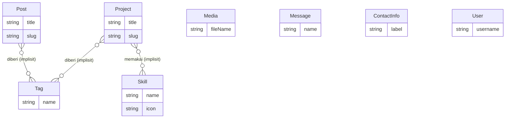

# DATABASE: Portfolio Developer

## Metadata

| | |
|---|---|
| **Tanggal** | 2026-07-17 |
| **Status** | Disetujui client |
| **Versi** | 2.10 |
| **Sumber** | Set BA v6.0 + Set UI/UX v1.8 |
| **Konteks** | docs/pm_01_project.md v1.6 |
| **Disusun oleh** | Tech Lead Agent |
| **Set dokumen** | techlead_01_architecture.md · techlead_02_database.md · techlead_03_api_contract.md · techlead_04_folder_structure.md |

## Ringkasan

**Delapan entitas** di PostgreSQL via **Prisma**: `Project`, `Post`, `Tag`,
`Skill`, `Media`, `Message`, `ContactInfo`, `User`. Revisi total dari v1.0
(7 entitas `Profile`/`ContactLink`/`Admin` berbasis pm v1.2) — perancangan
skema ulang menghasilkan struktur berbeda:

- **`Profile` dihapus total** — data identitas pemilik (nama, headline, bio,
  foto, CV, dan seluruh isi About) kini statis di kode, bukan data (pm_01 D007).
- **`Admin` → `User`** — murni akun login, tanpa data identitas.
- **`ContactLink` melebur ke `ContactInfo`** — satu tabel flat multi-baris
  (label, value, icon), bukan lagi singleton `ContactInfo` + child
  `ContactLink` terpisah.
- **`Skill` baru** — keahlian jadi tabel tersendiri (CRUD lewat SCR-14),
  bukan array field di `Profile`.
- **`Tag` baru** — label bebas dipakai bersama `Project` & `Post` (relasi
  m-n implisit), disiapkan untuk kebutuhan filter masa depan (G-014 BA).
- **`Media` baru** — katalog file terunggah (metadata saja; lihat Konvensi).
- **`Project`/`Post` dapat status tayang** — enum `PublishStatus`
  (DRAFT/PUBLISHED/ARCHIVED), menggantikan Data Awal wajib "CV NOT NULL" &
  asumsi "tanpa draf" (pm_01 D008).
- **`Message` dapat status baca/arsip** — enum `MessageStatus`
  (UNREAD/READ/ARCHIVED).

Seluruh `id` memakai **`String @default(cuid())`**, bukan `BigInt
autoincrement()` seperti v1.0 — keputusan baru (lihat Konvensi & D-008).
Tidak ada lagi entitas singleton — seluruh 8 tabel adalah tabel multi-baris
biasa.

**v2.2** (referensi desain admin client, pm_01 D009): tidak ada tabel baru —
`Tag` dan `Media` sudah ada sejak v2.0, kini dapat **permukaan CRUD/kelola
penuh** (SCR-17 Tags, SCR-18 Media) menggantikan pola inline-only/write-only
sebelumnya. `User.passwordHash` juga sudah ada sejak v2.0 — kini dapat
kemampuan **ubah mandiri** (SCR-19 Password) lewat Server Action baru, tanpa
field tambahan.

**v2.3** (celah kontrak ditemukan Issue Planner, D-016 techlead_01): tidak ada
tabel baru — `Skill` (ENT-04) dibaca publik lewat EP-17 baru
(`techlead_03_api_contract.md`), melengkapi EP-11 yang sebelumnya cuma
melayani sisi admin.

**v2.4** (perubahan kapabilitas tim, D-017 techlead_01): tidak ada tabel/kolom
baru — penyimpanan berkas pindah dari filesystem lokal ke Cloudflare R2;
satu-satunya efek di dokumen ini adalah deskripsi konvensi `thumbnailImage`/
`Media.url` (kini URL R2, bukan path lokal). Tipe kolom, skema, dan aturan
entitas semuanya tidak berubah.

**v2.5** (D-018 techlead_01, route group `app/(public)/`): dokumen ini
sama sekali tidak tersentuh — perubahan murni struktur folder presentation
(`techlead_04_folder_structure.md`), tidak menyentuh skema/entitas/data.
Versi dibump mengikuti "versi sama, dibaca bersama" set Tech Lead.

**v2.6** (D-019 techlead_01, `login/` dipindah keluar dari `admin/`):
dokumen ini juga sama sekali tidak tersentuh — perubahan murni struktur
folder presentation, tidak menyentuh skema/entitas/data.

**v2.7** (D-020 techlead_01, folder `core/` diganti nama jadi `shared/`):
dokumen ini juga sama sekali tidak tersentuh — murni rename folder
presentation/shared, tidak menyentuh skema/entitas/data.

**v2.8** (D-021 techlead_01, `EP-07`/`EP-08` dicabut sebagai Route Handler
digantikan `SA-22`/`SA-23` sebagai Server Action): dokumen ini juga sama
sekali tidak tersentuh — perubahan murni permukaan API (techlead_03),
tidak menambah/mengubah kolom `User` (ENT-08) atau entitas mana pun; `User`
tetap dibaca & diperbarui lewat mekanisme yang sama (Bcrypt compare/hash),
hanya jalur pemanggilannya yang berubah.

**v2.9** (D-022 techlead_01, sisa 15 Route Handler dicabut digantikan
`SA-24`..`SA-38`): dokumen ini juga sama sekali tidak tersentuh — sama
seperti v2.8, murni permukaan API; tidak ada tabel/kolom/relasi yang
berubah. Seluruh entitas tetap dibaca lewat Prisma Client yang sama,
hanya dipanggil dari Server Action, bukan Route Handler.

**v2.10** (D-023 techlead_01, folder fitur pindah ke pola flat 4-file):
dokumen ini juga sama sekali tidak tersentuh — murni perubahan struktur
folder (`techlead_04_folder_structure.md`: `domain/`·`application/`·
`infrastructure/`·`presentation/` → `.action.ts`/`.services.ts`/
`.repository.ts`/`.schema.ts`), tidak menyentuh skema/entitas/data. Prisma
Client tetap diakses dari `*.repository.ts` tiap fitur (dulu `infrastructure/`).

## Konvensi

- Database: PostgreSQL 18 (Neon) — dari techlead_01_architecture.md.
- **Jalur format skema: Prisma** (07 §3.1) — blok `model`/`enum` di bawah
  adalah kontrak; migrasi & seed script tetap kerja BE.
- **ID: `String @id @default(cuid())`** di seluruh model (D-008, menggantikan
  `BigInt autoincrement()` v1.0) — id tidak bisa ditebak/dienumerasi lewat
  URL publik (`/portfolio/{slug}` tetap dipakai untuk URL, id tidak pernah
  tampil ke publik), dan berpasangan wajar dengan pola slug yang sudah
  dipakai di seluruh entitas berkonten.
- Kolom baku setiap model **kecuali `ContactInfo` dan `User`**:
  `createdAt DateTime @default(now())`, `updatedAt DateTime @updatedAt` —
  dua tabel itu sengaja tanpa timestamp (D-009): skala 1 baris/1 akun, tidak
  ada kebutuhan produk atau UI yang menampilkannya.
- **Tanpa `@map`/`@@map` — konvensi penamaan default Prisma apa adanya**
  (D-014): model **PascalCase singular** (`Project`, bukan `projects`) jadi
  nama tabel sebenarnya; field **camelCase** (`thumbnailImage`) jadi nama
  kolom sebenarnya, tanpa dipetakan ulang ke snake_case. Proyek ini tidak
  pernah menyentuh PostgreSQL secara langsung di luar Prisma Client (tidak
  ada raw SQL, tool eksternal, atau BI yang membaca skema) — sehingga tidak
  ada alasan menambah lapisan pemetaan nama yang cuma menambah baris tanpa
  manfaat (keputusan user, mencabut konvensi snake_case v2.0).
- **Slug** (`Project`, `Post`, `Tag`, `Skill`) dibuat **otomatis** dari
  `title`/`name` (slugify) saat simpan — bukan isian manual admin (D-010).
  `Tag`/`Skill` menyiapkan slug meski belum ada route yang memakainya, agar
  siap bila kebutuhan filter/halaman-per-tag muncul (G-014 BA).
- **Relasi m-n implisit Prisma**: `Project`↔`Tag`, `Post`↔`Tag`,
  `Project`↔`Skill` — cukup field array di kedua sisi model, Prisma
  membuat tabel penghubung otomatis (`_ProjectToTag`, `_PostToTag`,
  `_ProjectToSkill`); tidak ada model join manual (keputusan user saat
  perancangan skema).
- **Berkas unggahan** (`type: berkas`: `thumbnailImage`, `Media.url`) disimpan
  sebagai URL string ke objek Cloudflare R2 (techlead_01 — Penyimpanan Berkas,
  v2.4, D-017), bukan isi biner di database — beda dari v2.0-v2.3 yang
  menyimpan path relatif ke volume Docker lokal; bentuk field/tipe kolom
  tidak berubah, tetap `String`.
- **`Media` = katalog, bukan sumber kebenaran relasional** (D-011): field
  gambar di `Project`/`Post` (`thumbnailImage`) adalah string path langsung,
  **bukan** foreign key ke `Media`. `Media` hanya mencatat metadata tiap file
  yang pernah diunggah (untuk admin melihat/mengelola daftar file dari satu
  tempat) — dipilih di atas FK eksplisit karena skala kecil (1 admin,
  unggahan jarang) tidak sepadan dengan kompleksitas menjaga relasi
  tetap sinkron.
- **CV pemilik TIDAK ada di skema** — berkas statis, ditempel developer
  langsung ke kode/aset publik (pm_01 D007); tidak ada tabel/kolom/endpoint
  untuknya.

## ERD



## Entitas

### ENT-01 — Project (`Project`)

*Melayani: F-01.2, F-03, F-06.2 · US-003, US-004, US-010, US-011, US-019*

```prisma
model Project {
  id             String        @id @default(cuid())
  title          String        @db.VarChar(200) /// wajib — AC-010-2
  slug           String        @unique @db.VarChar(220) /// auto dari title (D-010)
  description    String?       @db.VarChar(300) /// gambaran singkat, wajib secara produk (AC-003-1, AC-010-2) — lihat catatan Aturan
  content        String        @db.Text /// deskripsi lengkap; dapat memuat "peran saya" (G-013 BA)
  demoUrl        String?       @db.VarChar(255) /// tampil hanya bila ada (AC-004-1)
  repositoryUrl  String?       @db.VarChar(255) /// "Tautan kode" di UI; tampil hanya bila ada (AC-004-1)
  thumbnailImage String?       @db.VarChar(255) /// opsional
  status         PublishStatus @default(DRAFT)  /// Draf/Terbit/Arsip (pm_01 D008)
  publishedAt    DateTime?                       /// diisi otomatis saat status pertama kali jadi PUBLISHED
  createdAt      DateTime      @default(now())
  updatedAt      DateTime      @updatedAt

  tags   Tag[]
  skills Skill[]

  @@index([slug])
  @@index([status, publishedAt])
}
```

**Relasi:** m-n implisit ke `Tag` & `Skill`.
**Aturan:** `description` divalidasi wajib di lapisan Zod (AC-010-2), bukan
`NOT NULL` skema — memungkinkan migrasi data lama tanpa pelanggaran
constraint. Penghapusan bersifat permanen (hard delete), selalu setelah
konfirmasi UI (AC-011-2) — terpisah dari status ARCHIVED (Assumption BA
A-003, direvisi). Hanya `status: PUBLISHED` tampil di halaman publik
(AC-003-1, AC-003-2); daftar publik urut `publishedAt desc`, daftar admin
urut `createdAt desc`.

### ENT-02 — Tulisan (`Post`)

*Melayani: F-01.2, F-04, F-06.3 · US-005, US-006, US-012, US-013, US-019*

```prisma
model Post {
  id             String        @id @default(cuid())
  title          String        @db.VarChar(200) /// wajib — AC-012-2
  slug           String        @unique @db.VarChar(220) /// auto dari title (D-010)
  description    String?       @db.VarChar(300) /// cuplikan, tampil di ItemTulisan
  content        String        @db.Text /// isi tulisan
  readingTime    Int                             /// dihitung sekali saat simpan (create/update) dari panjang content — tidak dihitung ulang tiap dibaca
  thumbnailImage String?       @db.VarChar(255) /// opsional — thumbnail kanan di list (C-05) & pratinjau saat dibagikan; TIDAK tampil di isi tulisan
  status         PublishStatus @default(DRAFT)   /// Draf/Terbit/Arsip (pm_01 D008)
  publishedAt    DateTime?                        /// diisi otomatis saat status pertama kali jadi PUBLISHED; tidak berubah saat diedit setelahnya
  createdAt      DateTime      @default(now())
  updatedAt      DateTime      @updatedAt

  tags Tag[]

  @@index([slug])
  @@index([status, publishedAt])
}
```

**Relasi:** m-n implisit ke `Tag`.
**Aturan:** status menggantikan asumsi lama "tersimpan = langsung tayang"
(Assumption BA A-006, direvisi pm_01 D008) — hanya `status: PUBLISHED`
tampil di Blog publik (AC-005-1, AC-005-2), urut `publishedAt desc`; daftar
admin urut `createdAt desc`, tanpa kategori (Assumption BA A-002, tag
melengkapi tanpa mengubah tampilan daftar). Penghapusan bersifat permanen,
selalu setelah konfirmasi UI (AC-013-2) — terpisah dari ARCHIVED.

### ENT-03 — Tag (`Tag`)

*Melayani: F-03, F-04 (metadata pendukung) — G-014 BA, belum ada story/AC
yang menuntut tampilan filter aktif*

```prisma
model Tag {
  id        String   @id @default(cuid())
  name      String   @unique @db.VarChar(50)
  slug      String   @unique @db.VarChar(60) /// auto dari name; disiapkan, belum ada route yang memakainya
  createdAt DateTime @default(now())

  posts    Post[]
  projects Project[]
}
```

**Relasi:** m-n implisit ke `Project` & `Post`.
**Aturan:** CRUD penuh lewat SCR-17 (tambah/ubah/hapus, pola sama Skill —
selalu konfirmasi sebelum hapus, AC-021-2); referensi desain admin client
(pm_01 D009, mencabut G-014 BA lama "inline-only, tanpa halaman kelola").
Menghapus tag yang masih dipakai `Project`/`Post` hanya melepas baris di
tabel penghubung implisit (`_ProjectToTag`/`_PostToTag`) — Prisma menangani
ini otomatis lewat `disconnect`, tidak menghapus `Project`/`Post` itu sendiri.

### ENT-04 — Skill (`Skill`)

*Melayani: F-01.2, F-06.4 · US-014, US-019*

```prisma
model Skill {
  id        String   @id @default(cuid())
  name      String   @unique @db.VarChar(50) /// wajib — AC-014-1
  slug      String   @unique @db.VarChar(60) /// auto dari name; disiapkan, belum ada route yang memakainya
  icon      String?  @db.VarChar(100)        /// nama ikon dari daftar tech-stack (SCR-14) — wajib secara produk, lihat Aturan
  createdAt DateTime @default(now())

  projects Project[]
}
```

**Relasi:** m-n implisit ke `Project`.
**Aturan:** `icon` divalidasi wajib di lapisan Zod (AC-014-1: "nama + ikon"),
bukan `NOT NULL` skema, konsisten pola `description` Project. CRUD penuh
lewat SCR-14 (tambah/ubah/hapus, selalu konfirmasi sebelum hapus — AC-014-2).
Dibaca publik lewat `SA-38` (v2.3, v2.9 D-022 — dulu `EP-17`) — bagian
Keahlian di Home (SCR-01) menampilkan seluruh baris ke pengunjung,
terpisah dari `SA-32` (dulu `EP-11`) yang khusus admin.

### ENT-05 — Media (`Media`)

*Melayani: infrastruktur unggahan (Kebutuhan Aset uiux_03_design_system.md)
— katalog, bukan relasi wajib entitas manapun*

```prisma
model Media {
  id        String   @id @default(cuid())
  fileName  String   @db.VarChar(255)
  objectKey String   @unique @db.VarChar(255)
  url       String   @db.VarChar(500)
  mimeType  String   @db.VarChar(100)
  extension String   @db.VarChar(20)
  size      Int
  createdAt DateTime @default(now())
}
```

**Relasi:** tidak ada (lihat Konvensi — katalog, bukan FK).
**Aturan:** satu baris dibuat tiap kali admin mengunggah file — baik lewat
halaman Media (SCR-18, galeri mandiri) maupun inline dari form Project/
Tulisan (G-016 BA); path hasilnya disalin ke field string terkait
(`thumbnailImage`, dst.) bila diunggah inline, atau dipilih dari galeri saat
mengisi form. Menghapus baris `Media` (SCR-18) TIDAK mengosongkan rujukan
`thumbnailImage` yang sudah tersalin ke `Project`/`Post` lain (tanpa FK,
G-017 BA — risiko diterima, skala kecil). Batas ukuran & jenis: gambar
(jpg/png/webp) ≤ 2MB (G-003, techlead_01_architecture.md).

### ENT-06 — Pesan (`Message`)

*Melayani: F-05.2, F-06.7 · US-008, US-018*

```prisma
model Message {
  id        String        @id @default(cuid())
  name      String        @db.VarChar(100) /// AC-008-1, AC-018-1
  email     String        @db.VarChar(255) /// AC-008-1, AC-018-1
  message   String        @db.Text         /// AC-008-1, AC-018-1
  status    MessageStatus @default(UNREAD) /// pm_01 D008
  createdAt DateTime      @default(now())
  updatedAt DateTime      @updatedAt

  @@index([status, createdAt])
}
```

**Relasi:** tidak ada.
**Aturan:** hanya dibuat (publik, tanpa status pilihan — selalu UNREAD) dan
dibaca/diarsipkan (admin) — tanpa story ubah isi (Scope Validation). Transisi
status: `UNREAD → READ` otomatis saat admin membuka/melihat pesan (AC-018-3);
`UNREAD|READ → ARCHIVED` saat admin menekan Arsipkan (AC-018-4);
`ARCHIVED → READ` saat admin menekan Kembalikan. Tampil terbaru dulu
berdasar `createdAt` (AC-018-1), disaring per tab Aktif (`UNREAD`+`READ`) /
Arsip (`ARCHIVED`).

### ENT-07 — Info Kontak (`ContactInfo`)

*Melayani: F-05.1, F-06.5 · US-007, US-015*

```prisma
model ContactInfo {
  id    String  @id @default(cuid())
  label String  @db.VarChar(100) /// nama saluran (mis. "Email", "LinkedIn") — AC-007-1
  value String  @db.VarChar(255) /// alamat/tautan saluran — AC-007-1
  icon  String? @db.VarChar(100)
}
```

**Relasi:** tidak ada.
**Aturan:** tabel flat multi-baris (D-013, mencabut desain singleton v1.0
`ContactInfo`+`ContactLink`) — setiap saluran (termasuk email) adalah
baris biasa, tanpa field email khusus. CRUD penuh lewat SCR-15
(tambah/ubah/hapus per baris, BarisKelola) — menggantikan pola "replace-all
sekaligus" v1.0 (AC-015-1 tetap terpenuhi: halaman Contact menampilkan
versi terbaru setelah admin menyimpan perubahan apa pun).

### ENT-08 — User (`User`)

*Melayani: F-06.1, F-06.6 · US-009, US-016*

```prisma
model User {
  id           String @id @default(cuid())
  username     String @unique @db.VarChar(50) /// data masuk — AC-009-1
  passwordHash String                          /// hash Bcrypt (TEAM_STACK.md)
}
```

**Relasi:** tidak ada.
**Aturan:** tepat satu akun, disiapkan saat Data Awal — tanpa registrasi
publik (Assumption BA A-005). Murni kredensial login — **tidak** menyimpan
data identitas pemilik (nama/bio/foto/dst., yang seluruhnya statis di kode,
pm_01 D007); ini beda dari `Admin` v1.0 hanya soal nama tabel. Admin dapat
mengganti `passwordHash` miliknya sendiri lewat SCR-19 (AC-023-1) — wajib
verifikasi kata sandi lama yang cocok sebelum menyimpan yang baru (G-018 BA).

## Status & Transisi

**`PublishStatus`** (`Project`, `Post`) — `DRAFT` (default, belum tampil
publik) → `PUBLISHED` (tampil publik) → `ARCHIVED` (pernah publik, kini
disembunyikan). Bukan mesin status linear ketat: admin bebas memindahkan ke
status mana pun lewat satu isian dropdown/radio di form yang sama (G-011 BA,
C-16 PilihanStatus) — termasuk `ARCHIVED → PUBLISHED` langsung tanpa lewat
`DRAFT`. `publishedAt` diisi sekali saat pertama kali menyentuh `PUBLISHED`,
tidak berubah lagi setelahnya (dipakai sebagai kunci urut publik, agar
konten yang sempat diarsipkan lalu diterbitkan ulang tidak "melompat" ke
atas seolah baru).

**`MessageStatus`** (`Message`) — `UNREAD` (default) → `READ` (otomatis saat
dibuka admin, AC-018-3) → `ARCHIVED` (manual, AC-018-4) → `READ` (saat
dikembalikan). Lihat Aturan ENT-06 untuk transisi lengkap.

Tidak ada mesin status lain — proyek ini tanpa transaksi/pesanan. Lihat
Keputusan & Trade-off techlead_01_architecture.md.

## Data Awal

| Data | Isi | Alasan |
|------|-----|--------|
| 1 akun `User` | `username` + `passwordHash` (diganti saat serah terima) | Tanpa registrasi publik (Assumption BA A-005); sistem tidak bisa dikelola tanpanya |

Tidak ada lagi Data Awal wajib untuk Profil/Info Kontak/CV (v1.0 dicabut) —
identitas pemilik kini statis di kode (deploy-time, bukan seed database);
`ContactInfo`, `Skill`, `Project`, `Post` boleh kosong saat peluncuran
dan diisi admin setelahnya lewat halaman kelola (AC-003-2, AC-005-2 —
kondisi kosong ditangani wajar oleh UI).

## Handoff

- Dokumen ini bagian dari **set blueprint Tech Lead** proyek Portfolio Developer:
  techlead_01_architecture.md + techlead_02_database.md + techlead_03_api_contract.md +
  techlead_04_folder_structure.md (versi sama, dibaca bersama).
- **Sumber:** set BA v6.0 (FEATURE + USER_STORY + ACCEPTANCE_CRITERIA) +
  set UI/UX v1.8 (USER_FLOW + WIREFRAME + DESIGN_SYSTEM),
  konteks docs/pm_01_project.md v1.6 (+ TEAM_STACK.md sebagai sumber stack).
- **Penerima:** FE & BE Agent (via Issue Planner); QA memakai API_CONTRACT
  sebagai acuan uji.
- **Pertanyaan hilir** tentang stack/data/API yang tak terjawab set ini =
  kekurangan dokumen Tech Lead → dikembalikan ke Tech Lead; pertanyaan tentang
  tampilan/alur → ke UI/UX; tentang requirement → ke BA.
- **Perubahan kebutuhan** ditangani dari hulu: siklus PM → BA → UI/UX → set ini
  terbit versi baru. Tidak diedit langsung.
